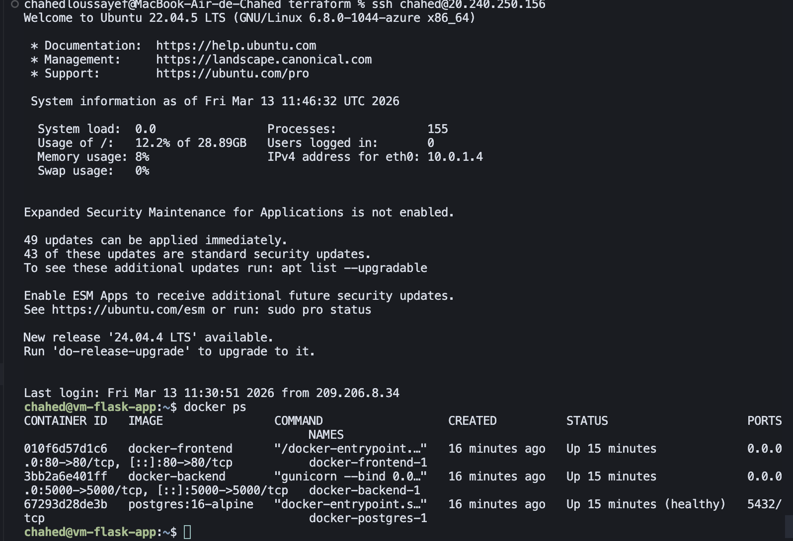

# Rapport — Image Clock sur Azure

**Projet** : Application web Image Clock deployee sur Azure avec Terraform et Ansible

## 1. Presentation

Horloge web dont les chiffres peuvent etre remplaces par des images. Les images sont stockees sur Azure Blob Storage. Toute l'infrastructure est automatisee : un `terraform apply` cree la VM, installe Docker, deploie l'app.

**Stack** : Flask, PostgreSQL, Nginx, Docker Compose, Terraform, Ansible, Azure.

## 2. Infrastructure

### 2.1 Terraform init

Telecharge les providers necessaires (azurerm, time, local, null).

```bash
cd infra/terraform
terraform init
```


### 2.2 Terraform plan

Affiche les ressources qui vont etre creees.

```bash
terraform plan
```

Ressources creees :
- Resource Group
- VNet + Subnet
- IP publique statique
- NSG (ports 22, 80, 5000)
- VM Ubuntu 22.04
- Storage Account + Container Blob


### 2.3 Terraform apply

Cree toutes les ressources Azure puis lance Ansible automatiquement.

```bash
terraform apply
```


### 2.4 Outputs

```bash
terraform output
```


## 3. Verification du deploiement

### 3.1 Portail Azure


### 3.2 Health check

```bash
curl http://<IP>:5000/health
```


### 3.3 API — CRUD Items

```bash
curl -X POST http://<IP>:5000/api/items \
  -H "Content-Type: application/json" \
  -d '{"title":"Test","description":"Premier item"}'

curl http://<IP>:5000/api/items
```


### 3.4 API — Digits de l'horloge

```bash
curl http://<IP>:5000/api/clock/digits
```


### 3.5 Frontend

Ouvrir `http://<IP>` dans le navigateur.


### 3.6 SSH

```bash
ssh <user>@<IP>
docker ps
```



## 4. Destruction

```bash
terraform destroy
```


## 5. Problemes rencontres et solutions

| # | Probleme | Cause | Solution |
|---|----------|-------|----------|
| 1 | `SkuNotAvailable` | VM non disponible dans `germanywestcentral` | Changement de region vers `swedencentral` |
| 2 | 404 apres creation de ressources | API Azure "eventually consistent" | Ajout `time_sleep` 30s apres le Resource Group |
| 3 | `permission denied` docker socket | Groupe docker pas encore actif dans la session SSH | `meta: reset_connection` dans le role Ansible docker |
| 4 | Variables Postgres vides | Docker Compose ne lisait pas le `.env` a la racine | Ajout `--env-file .env` a la commande docker compose |
| 5 | Ansible bloque sur passphrase SSH | Cle SSH avec mot de passe | Regeneration de la cle sans passphrase |

## 6. Synthese

Le projet automatise entierement le deploiement :

```
terraform apply
   |-- Cree les ressources Azure (VM, reseau, stockage)
   |-- Lance Ansible
   |      |-- Installe Docker
   |      |-- Clone le repo
   |      |-- Genere le .env
   |      |-- Lance docker compose
   |      |-- Verifie que tout repond
   |-- Affiche les URLs

terraform destroy
   |-- Supprime tout
```

Reproductible : n'importe qui peut cloner le repo, remplir `terraform.tfvars`, et obtenir l'application en 5 minutes.
